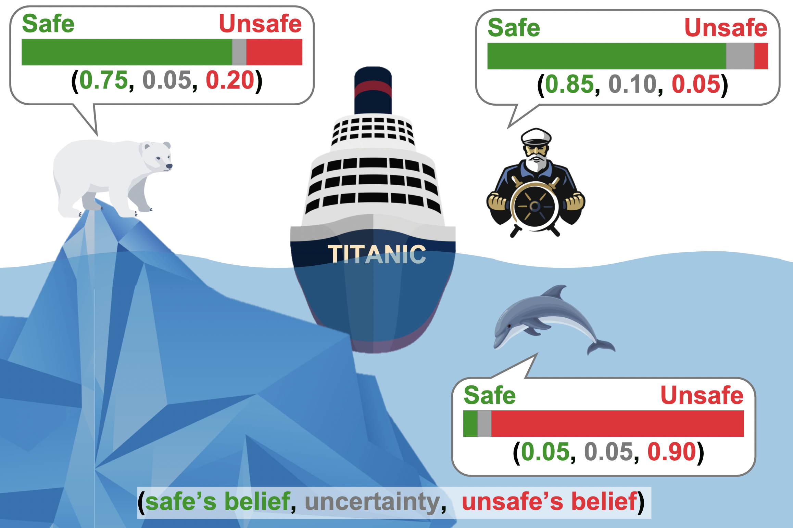
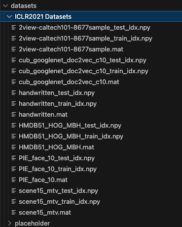
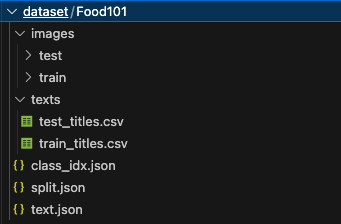

<h2 align="center">
Navigating Conflicting Views: Harnessing Trust for Learning
</h2>

<h5 align=center>

[](https://icml.cc/virtual/2025/poster/43734)
[]()
[](https://arxiv.org/abs/2406.00958)

</h5>

<h5 align="center"> If you like our project, please give us a star ⭐ on GitHub.</h5>


### 🎯 Overview
This is the official implementation of Navigating Conflicting Views: Harnessing Trust for Learning.
We introduce Trust Discount (TD) based on Computational Trust for handling conflicting views in Evidential Multiview Learning.

<p align=center>

<p>

### 🕹️ Usage
#### Installation
```{shell}
conda create -n mvl python=3.8
conda activate mvl

conda install pytorch==1.13.0 torchvision==0.14.0 torchaudio==0.13.0 pytorch-cuda=11.7 -c pytorch -c nvidia
pip install h5py scikit-learn matplotlib scipy statsmodels
```

#### Dataset
- Please contact [TMC/ETMC's](https://github.com/hanmenghan/TMC) authors for accessing the six multiview datasets, then put all data files under `Trust/datasets/ICLR2021 Datasets` as follows, indices files are already provided.

- For UPMC-Food101, we download it from Kaggle using this [link](https://www.kaggle.com/datasets/gianmarco96/upmcfood101), and prepare the datasets as following structure, three JSON files are already provided.

<p align="left" style="display: flex; align-items: flex-start;">
  
  
</p>


#### Run the Experiments
We provide necessary scripts as well as the used hyper-parameters for running our codes,
as in `Trust/scripts`.
For example,
```
cd Trust
sh scripts/train_etf_scene.sh
```
or
```
cd TrustEnd2End_Food
python train_etf.py --v-num 0
```


### 🔗 Citation
If you find this repository useful, please cite our paper:
```
@inproceedings{lu2025navigating,
  title={Navigating Conflicting Views: Harnessing Trust for Learning},
  author={Lu, Jueqing and Buntine, Wray and Qi, Yuanyuan and Dipnall, Joanna and Gabbe, Belinda and Du, Lan},
  booktitle={Proceedings of the 42nd International Conference on Machine Learning (ICML)},
  year={2025},
  organization={PMLR}
}
```
We also recommend other related work but not limited to as follows,
- Trusted Multi-View Classification [[paper]](https://arxiv.org/abs/2102.02051)
- Trusted Multi-View Classification with Dynamic Evidential Fusion [[paper]](https://arxiv.org/abs/2204.11423)
- Reliable Conflictive Multi-View Learning [[paper]](https://arxiv.org/abs/2402.16897)
- Trusted Multi-view Learning with Label Noise [[paper]](https://www.ijcai.org/proceedings/2024/0582.pdf) 
- Trusted Multi-view Learning under Noisy Supervision [[paper]](https://arxiv.org/abs/2404.11944)
- Trusted Multi-View Deep Learning with Opinion Aggregation [[paper]](https://ojs.aaai.org/index.php/AAAI/article/view/20724)
- Safe multi-view deep classification [[paper]](https://ojs.aaai.org/index.php/AAAI/article/view/26066)
- Safe multi-view deep classification [[paper]](https://ojs.aaai.org/index.php/AAAI/article/view/26066)
- Enhancing Multi-View Classification Reliability with Adaptive Rejection [[paper]](https://ojs.aaai.org/index.php/AAAI/article/view/26066)
- Enhancing Testing-Time Robustness for Trusted Multi-View Classification in the Wild [[paper]](https://openaccess.thecvf.com/content/CVPR2025/papers/Liu_Enhancing_Testing-Time_Robustness_for_Trusted_Multi-View_Classification_in_the_Wild_CVPR_2025_paper.pdf)
- Trusted Multi-View Classification via Evolutionary Multi-View Fusion [[paper]](https://openreview.net/pdf?id=U64wEbM7NB)
- Trusted Multi-View Classification with Expert Knowledge Constraints [[paper]](https://openreview.net/pdf?id=M3kBtqpys5)


