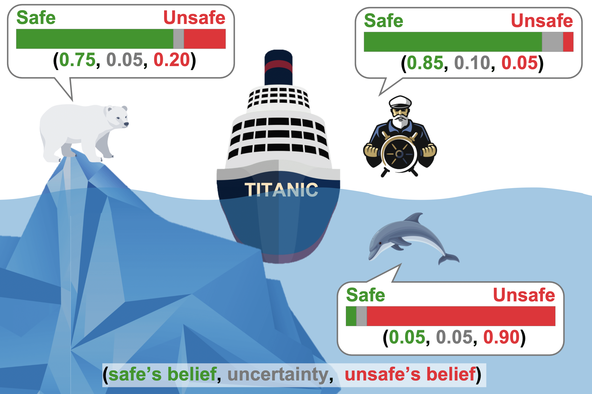

<h2 align="center">
Navigating Conflicting Views: Harnessing Trust for Learning
</h2>

<h5 align="center"> If you like our project, please give us a star ⭐ on GitHub.</h5>
<h5 align=center>


[](https://arxiv.org/abs/2406.00958)

</h5>


### 🎯 Overview
This is the official implementation of Navigating Conflicting Views: Harnessing Trust for Learning.
We introduce Trust Discount (TD) based on Computational Trust for handling conflicting views in Evidential Multiview Learning.

<h5 align=center>

</h5>

### 🕹️ Usage
#### Installation
```{shell}
conda create -n mvl python=3.8
conda activate mvl

conda install pytorch==1.13.0 torchvision==0.14.0 torchaudio==0.13.0 pytorch-cuda=11.7 -c pytorch -c nvidia
pip install h5py scikit-learn matplotlib scipy statsmodels
```

#### Dataset
- Please contact [TMC/ETMC's](https://github.com/hanmenghan/TMC) authors for accessing the six multiview datasets,  then put all data files under `Trust/datasets/ICLR2021 Datasets` as follows, indices files are already provided.

- For UPMC-Food101, we download it from Kaggle using the this [link](https://www.kaggle.com/datasets/gianmarco96/upmcfood101), and prepare the datasets as following structure, three json files are already provided.

<p align="left" style="display: flex; align-items: flex-start;">
  
  
</p>


#### Run the Experiments
We provide necessary scripts as well as the used hyper-parameters for running our codes,
as in `Trust/scripts`.
For example,
```
cd Trust
sh scripts/train_etf_scene.sh
```
or
```
cd TrustEnd2End_Food
python train_etf.py --v-num 0
```


### 🔗 Citation
If you find this repository useful, please cite our paper:
```
@inproceedings{lu2025navigating,
  title={Navigating Conflicting Views: Harnessing Trust for Learning},
  author={Lu, Jueqing and Buntine, Wray and Qi, Yuanyuan and Dipnall, Joanna and Gabbe, Belinda and Du, Lan},
  booktitle={Proceedings of the 42nd International Conference on Machine Learning (ICML)},
  year={2025},
  organization={PMLR}
}
```
